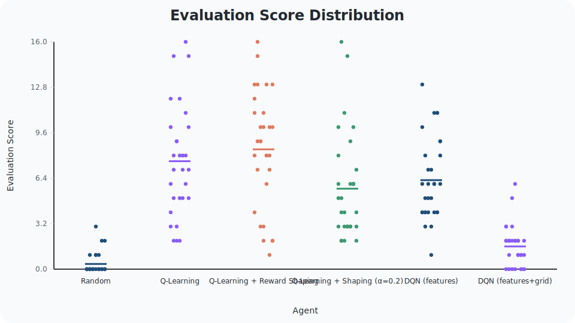
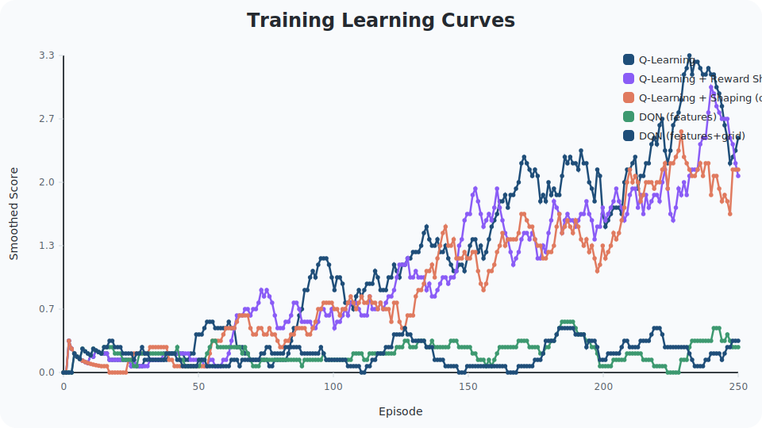
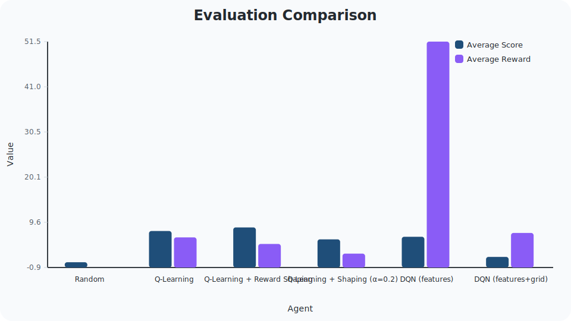
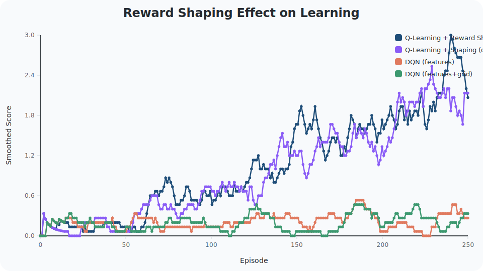

# School of Information Technologies and Engineering, ADA University
# CSCI3613 – Artificial Intelligence
# Spring 2026
## Course Project Report
### Team <number>

| Full Name | Student ID |
| --- | --- |
| Member 1 |  |
| Member 2 |  |
| Member 3 |  |
| Project | Snake RL: Comparative Agents |

---

# Snake RL Experimental Report

This report studies Snake as a reinforcement learning problem and compares the implemented agents in the repository: a random baseline, tabular Q-learning, Q-learning with reward shaping, DQN with feature-only state, and DQN with feature-plus-grid state.

## 1. Problem formulation

Snake is a good RL benchmark because each decision affects both immediate safety and future opportunity: moving toward food can improve long-term return, but a locally safe action may still lead to a poor trajectory later. The task therefore captures the core RL trade-off between short-term survival and long-term reward.

The game can be modeled as a finite Markov decision process. The state consists of the snake position, food position, and heading on a discrete grid. The action space contains four moves: up, right, down, and left. Some actions are illegal in practice because the snake cannot reverse directly into its own body, and the implementation masks those actions during action selection and bootstrapped target computation.

The reward function combines a small step penalty, a positive terminal reward for eating food, and a negative terminal reward for collision. An episode terminates when the snake hits the wall, collides with itself, or reaches the maximum step limit. The objective is to maximize cumulative return while also increasing the episode score, which corresponds to the amount of food consumed.

## 2. Related work

Reinforcement learning methods learn from interaction rather than labeled examples, which makes them suitable for tasks such as Snake where the correct action depends on the current state and the consequences of future moves. Tabular Q-learning estimates an action-value table directly from experience and is effective when the state representation is compact. Deep Q-Networks extend Q-learning with a neural approximator, replay memory, and a target network so that higher-dimensional observations can be used.

Reward shaping is a standard technique for sparse-reward problems. By adding dense progress signals, it can accelerate learning and reduce the credit-assignment burden, but overly strong shaping can distort the original objective if the auxiliary signal becomes more important than the terminal task reward.

## 3. EDA and preprocessing

This project does not use a static dataset. The relevant analysis is therefore environment analysis: grid size, observation structure, legal actions, reward signals, and episode termination. The default Snake environment uses a 10x10 grid, while the DQN experiments use a smaller 6x6 grid to improve sample efficiency and reduce the state-space burden.

Each environment observation is a dictionary with two components. The feature vector encodes immediate danger, food direction, and current heading. In the repository implementation, this vector has 11 values: three danger indicators, four food-direction indicators, and four one-hot direction values. The grid component is a 3-channel tensor with shape 3 x height x width: channel 0 marks the snake body, channel 1 marks food, and channel 2 stores the current heading as a constant value across the grid.

Two DQN state encodings are compared:

The feature-only encoding is the most compact representation and is well aligned with the local decision structure of Snake. The feature + grid encoding adds spatial detail, but that extra information also increases input dimensionality and makes optimization harder on a limited number of training episodes. In this project, the grid representation is therefore richer, but less sample-efficient.

For tabular Q-learning, the feature vector is further binarized into a discrete state key before being stored in the Q-table. For DQN, the observation is converted into a numeric input vector, and the feature + grid variant simply appends the flattened grid to the feature vector.

<!-- EDA Figures -->

## 4. Implementation

The environment is implemented in `SnakeEnv` and exposes `reset`, `step`, `legal_actions`, and ASCII rendering. It tracks the snake body, spawns food uniformly at random on empty cells, and prevents direct reversal into the current body direction. Reward shaping is implemented inside the environment by adding progress-based terms when `reward_shaping=True`.

The project includes the following agents:

- Random Agent: selects uniformly among legal actions and serves as the non-learning baseline.
- Tabular Q-learning: stores action values in a dictionary keyed by the binary feature state.
- Q-learning with reward shaping: uses the same learner but with shaped rewards enabled in the environment.
- DQN with feature-only state: uses a neural network with replay memory and a target network.
- DQN with feature + grid state: uses the same algorithm with a larger input vector.

The Q-learning implementation uses epsilon-greedy exploration, a discount factor of 0.95, and bootstrapped targets that ignore illegal opposite actions. The DQN implementation uses an Adam optimizer, Huber loss, replay memory, gradient clipping, target-network updates, and epsilon decay. During action selection and target computation, illegal opposite actions are masked so that the agent does not learn from impossible moves.

For the DQN experiments, the repository uses a 6x6 Snake configuration with stronger terminal rewards and stronger shaping terms than the default environment. This choice improves sample efficiency and makes learning observable within a modest training budget.

## 5. Experiments

Experiments were run with seed 42, 250 training episodes, and 30 evaluation episodes. The same evaluation seeds were shared across agents to make the comparison as fair as possible. Training and evaluation follow the repository scripts and the generated figures in `report_assets`.

| Agent | Evaluation Episodes (n) | Average Score ± std | Average Reward ± std | Average Steps ± std | Best Score |
| --- | ---: | ---: | ---: | ---: | ---: |
| Random | 30 | 0.37 ± 0.76 | -0.85 ± 0.77 | 23.30 ± 16.04 | 3 |
| Q-learning | 30 | 7.60 ± 3.85 | 6.13 ± 3.61 | 55.90 ± 28.68 | 16 |
| Q-learning + reward shaping | 30 | 8.43 ± 4.11 | 4.60 ± 2.89 | 63.63 ± 30.62 | 16 |
| Q-learning + shaping (alpha=0.2) | 30 | 5.67 ± 3.71 | 2.36 ± 2.37 | 49.83 ± 32.37 | 16 |
| DQN features | 30 | 6.27 ± 2.90 | 51.48 ± 28.55 | 28.67 ± 12.58 | 13 |
| DQN features + grid | 30 | 1.60 ± 1.45 | 7.15 ± 13.09 | 62.90 ± 40.85 | 6 |

Figures generated with the project are shown below.

The training curves show how quickly each learning agent improves during training. The shaped Q-learning variants rise earlier than the unshaped baseline, while the DQN curves are more sensitive to representation choice and optimization stability.

This comparison figure summarizes the evaluation averages. It shows that the random agent remains far below the learning methods, and that the tabular method is competitive with or better than the neural method in this small-grid setting.

This figure isolates the effect of reward shaping on Q-learning. The shaped variant learns faster initially, but the gains are not uniformly better across all metrics, which indicates that shaping helps optimization but does not automatically improve the final policy.

The score distribution plot shows the spread of episode outcomes. Wider spread indicates more stochastic behavior and policy brittleness, while tighter spread suggests more consistent decision-making.

## 6. Discussion of results

The random agent performs poorly because it has no memory of past outcomes and no mechanism for associating states with good actions. It may occasionally survive or eat food by chance, but it cannot reliably optimize long-term return.

Tabular Q-learning performs strongly because the state space is compact enough for value estimates to become meaningful. The feature representation captures the most important local information: immediate danger, food direction, and heading. This is sufficient for a good policy in the standard Snake environment, which explains why Q-learning reaches an average score of 7.60 and a best score of 16.

Reward shaping improves learning speed by giving the agent a denser signal when it moves toward food. In the results, the shaped Q-learning variant achieves the highest average score, 8.43, but its average reward is lower than the unshaped baseline. This shows that shaping can make the agent more food-seeking without necessarily improving the original return in every case. If the shaping terms are too strong, they can encourage behavior that follows the proxy reward rather than the underlying objective.

DQN is more sample-inefficient than tabular Q-learning because it must fit a neural network and estimate value structure from experience rather than update a table entry directly. The feature-only DQN performs better than the feature + grid version in this setting because the compact representation is easier to optimize with a limited training budget. The grid-augmented input increases dimensionality and can introduce unnecessary complexity on a small 6x6 environment, where the additional spatial detail does not always translate into better decisions.

The DQN results also highlight hyperparameter sensitivity. Replay memory size, epsilon decay, target update cadence, and training frequency all affect stability, and poor choices can slow learning or make performance inconsistent. The larger input representation also increases the risk of overfitting to noisy experience, which makes optimization and generalization less reliable under a small sample budget.

## 7. Limitations and conclusion

This project is limited by the small grid-world setting, a finite evaluation budget, and the inherent stochasticity of reinforcement learning. The reported averages are informative, but they still depend on random seeds, replay sampling, and exploration history. DQN in particular remains sensitive to hyperparameter choices and may require additional tuning to outperform a strong tabular baseline consistently.

Overall, the project shows that Snake is a useful RL benchmark for comparing learning dynamics under different reward designs and state encodings. The results highlight a central trade-off in reinforcement learning: more complex models are not automatically better if the representation is hard to optimize or the available experience is limited. In this setting, reward design and state representation matter as much as model capacity, and a simpler encoding can be more effective than a richer one when sample efficiency is the main constraint.
